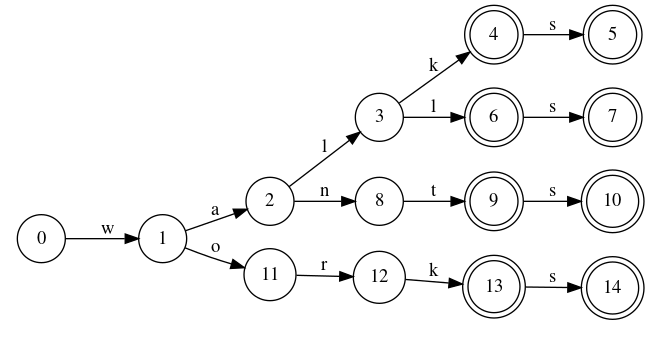
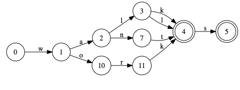

# [Finite-state Automata](https://dsacl3-2019.github.io/a4/)

An FSA implemented in Python. 

### Key functions

* ### Generating strings from finite state automata 

The FSA class keeps the FSA transition table
as a Python dictionary with `(source_state, symbol)` tuples as index,
where the value is the set of target states 
reached from the `source_state` with the `symbol`.
Naturally, if the automaton is a DFA, the value is a singleton set.

The method `generate()` should traverse the automaton in a depth-first manner,
returning all or a limited number of strings accepted by the automaton as specified in the template.

* ### Trie-based FSA

The function `insert_words()`
in file [lexicon.py](lexicon.py)
which reads a list of words from a given file,
uses the FSA class as a way to insert all words into a trie.
The resulting trie (FSA) should be a DFA,
where arc labels are letters as in the following figure
showing an example trie with words
_walk_, _walks_, _wall_, _walls_, _want_, _wants_, _work_ and _works_.

 
It generates all and the only the words inserted.

* ### Compacting the lexicon: minimization

The minimized FSA of the previous example should look like this:

_The images are auto-generated by `graphviz` from the dot files by the `to_dot()` function in `fsa.py`._
